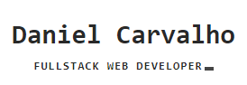

  
  

  
  

## Hi there! </h2>

### Abstract

- 👨‍💻 I'm currently working full-time at **Pluricosmética**.
- 🌱 Learning more about and studying: **NodeJS, Docker and VueJs**.
- 💙 Interests: games 👾, sports, learning new things.

### Languages and Tools

 

  
  
  
  
  
  
  
   
   
  

### Find me around the web 🌎:

- 💼 Connecting and sharing professional updates on <a href="https://www.linkedin.com/in/daniel-carvalho-72287516b/">LinkedIn</a>.
- 🐦 Check out my<a href="https://danielcarvalho.netlify.app/">Website</a>.
